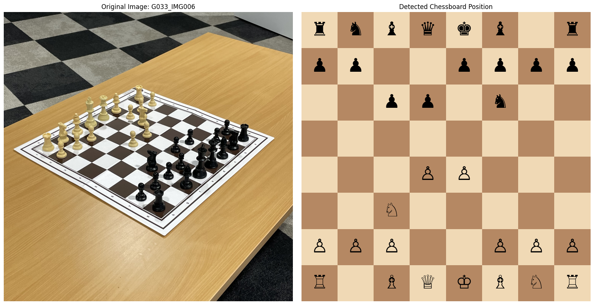

# ♟️ Chess Board Recognition

## 🎯 Project Results

Reconstructed chessboard state from a real image:


The methodology, experiments and results of the project are documented in the following reports:
- Task 1 Report: [Traditional Computer Vision](path/to/task1_report.pdf)
- Tasks 2 & 3 Report: [Deep Learning & Chessboard Digital Twin](path/to/task2_task3_report.pdf)


## 📖 Overview

This project explores computer vision and deep learning techniques for automatically interpreting chessboard images, progressing from traditional image processing methods to deep-learning-based detection and board reconstruction. It was developed as part of the Computer Vision course at FEUP 2024/2025, and consists of the first contact I had with computer vision and object detection.

The project was divided into three tasks:

- **Task 1 — Traditional Computer Vision:** Detect and segment the chessboard, determine its orientation and grid, identify occupied squares, and estimate piece bounding boxes using classical image processing techniques.
- **Task 2 — Piece Counting:** Estimate the total number of pieces on the board using CNN-based classification, regression, and object-detection approaches.
- **Task 3 — Chess Piece Detection & Digital Twin:** Detect individual chess pieces and reconstruct the complete state of the board, including piece type, colour, and position using deep learning models.

---

## 🛠️ Setup

The project requires **Python 3.x**.

Create a virtual environment from the project root:

```bash
python3 -m venv venv
```

Activate it:

```bash
# macOS / Linux
source venv/bin/activate

# Windows
venv\Scripts\activate
```

Install the required dependencies:

```bash
pip install -r requirements.txt
```

---

## 🚀 Running the Pipelines

### 1. Configure the Input
The project uses an input/output JSON interface. To run one of the tasks, create a file named `input.json` with the paths of the relevant input images to process, following the format:

```json
{
    "image_files": [
        "absolute_path/example1.jpg",
        "absolute_path/example2.jpg",
        ...
    ]
}
```

The project root contains an example `input.json` file with sample image paths for reference.

### 2. Run tasks

#### Task 1
To execute the task 1 pipeline, move the created json file to the `task-1` directory and run the following command from the project root:

```bash
python task-1/pipeline.py
```

#### Task 2
To execute the task 2 pipeline, move the created json file to the `tasks-2_3/task2/run_models/` directory and run the following command from the project root:

```bash
python tasks-2_3/task2/run_models/main.py
```

#### Task 3
Task 3 was developed in a Jupyter Notebook environment, found [here](tasks-2_3/TASK3MainNotebook.ipynb). To execute the task 3 pipeline, open the notebook and follow the instructions provided within.

### 3. Retrieve the Results
For tasks 1 and 2, the pipeline reads the images specified in `input.json` and performs the corresponding chessboard recognition task. In the respective task folder, the output will be generated in a file named `output.json`, containing the results of the processing.

Depending on the selected task, the output contains information such as:

- Number of detected pieces
- Piece bounding boxes
- Board occupancy
- Piece colour
- Piece type
- Piece position on the 8×8 board

---

## 📝 Notebook results

To explore the results of the experiments and models used, task 2 outputs can be found in notebooks inside the `tasks-2_3/task2/notebooks` folder. 

For task 3, the main notebook used can be found [here](tasks-2_3/TASK3MainNotebook.ipynb), which contains the implementation with YOLO that delivered the best results in experiments. The worse implementation with Faster R-CNN can be be found [here](tasks-2_3/fasterR-CNN.ipynb).

---

## 📊 Dataset

For Tasks 2 and 3, the models were trained and evaluated using the entire **ChessRed2K** dataset. Task 1 was developed using a smaller subset of the same dataset.

## 🧩 Detailed Task implementations

Task implementations are detailed in the [Task 1 Report](path/to/task1_report.pdf) and Tasks 2 & 3 Report (Deep Learning & Chessboard Digital Twin) (path/to/task2_task3_report.pdf). They are also summarized below, for quick reference.

### Task 1 — Traditional Computer Vision

The first task was implemented exclusively using classical computer vision techniques.

The pipeline consists of:

1. **Chessboard segmentation**
   - Table/background segmentation using colour filtering.
   - Morphological operations and contour analysis.
   - Canny edge detection and contour selection.
   - Convex hull and polygon approximation to identify the board.

2. **Perspective correction and orientation**
   - Perspective warping using the detected board corners.
   - SIFT feature matching to identify the orientation marker.
   - FLANN matching and RANSAC-based homography estimation.
   - Rotation to a canonical board orientation.

3. **Grid detection**
   - Hough line detection.
   - Density-based analysis of detected lines.
   - Geometric identification of the playable 8×8 grid.
   - Second perspective transformation to isolate the board tiles.

4. **Piece occupancy detection**
   - Division of the board into 64 tiles.
   - Hough Circle detection based on the common circular base of the pieces.
   - Heuristics based on circle position within each tile.
   - Black/white piece identification.

5. **Bounding-box estimation**
   - Projection of detected tile coordinates back into the original image.
   - Colour-based segmentation and morphological filtering.
   - Contour analysis and minimum bounding rectangles.

---

### Task 2 — Piece Counting

The objective was to determine the total number of chess pieces present on the board.

Three approaches were investigated:

- **CNN classification:** ResNet-50 with a 33-class output representing piece counts from 0–32.
- **CNN regression:** ResNet-50 with a single continuous output representing the number of pieces.
- **Object detection:** Counting the bounding boxes generated by the YOLO model developed for Task 3.

Several training configurations were compared, including data augmentation, weighted sampling to address class imbalance, and hybrid approaches combining CNNs with the board preprocessing pipeline from Task 1.

The hybrid approaches used board detection, perspective correction, and orientation normalization before passing images to the neural network.

---

### Task 3 — Chess Piece Detection & Digital Twin

The final task extended the project from simply counting pieces to understanding the complete board state.

The objective was to:

- Detect individual chess pieces.
- Determine their **type and colour**.
- Determine their **position on the 8×8 board**.
- Produce a structured **digital representation of the chessboard**.

The pipeline consisted of:
- A YOLOv11 model was used to localize the bounding boxes and classes of individual pieces. 
- In parallel, a modified ResNet-34 network outputs 4 heatmaps, one for each corner of the chessboard. 
- Following, the detected pieces are mapped to their respective board positions by comparing their bounding box coordinates against the position of individual tiles that make up the 8x8 board grid. 
- Finally, and a digital twin representation of the chessboard is generated.

---

## 👥 Authors

- **Jaime Fonseca** (up202108789@up.pt)
- **Martim Maciel** (up202400313@up.pt)
- **Miguel Lima** (up202108659@up.pt)
- **Pedro Ferreira** (up202409828@up.pt)

> Forked from [https://github.com/JaimeFRF/feup-vcom](https://github.com/JaimeFRF/feup-vcom) and [https://github.com/JaimeFRF/feup-vcom2](https://github.com/JaimeFRF/feup-vcom2) 

Computer Vision Project — Faculty of Engineering, University of Porto 2024/2025

---